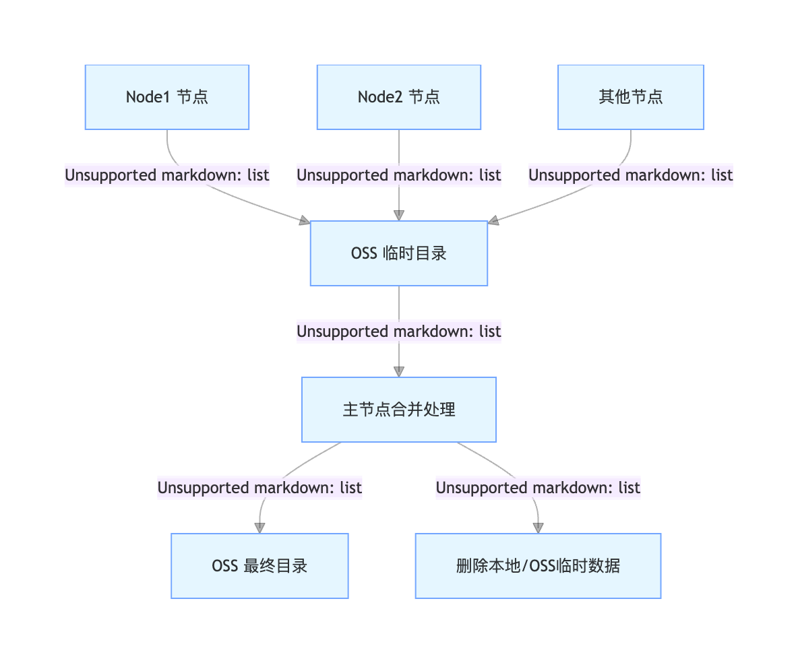

# 多节点日志合并归档解决方案

## 一、方案背景与目标

### 1. 问题背景

在多节点部署环境中（如 K8s 集群的 Node1、Node2 节点），同一服务的日志可能分散存储在不同节点：

- 服务重启后日志切换至新节点存储
- 同日期的日志文件在多节点间分散存在
- 直接上传 OSS 易发生文件覆盖，且无法追溯日志来源

### 2. 核心目标

1. 避免多节点日志文件覆盖冲突
2. 实现同服务、同日期的多节点日志合并归档
3. 保留日志时序完整性与节点溯源能力
4. 自动化执行（每月定时处理，无需人工干预）

## 二、整体方案设计

采用 **“分阶段处理”** 架构，分为 “节点预处理” 和 “主节点合并” 两个核心阶段，通过 OSS 临时目录实现数据流转，最终归档至统一目录。

### 流程总览

```
graph TD
    A[Node1 节点] -->|1. 压缩上月日志| B[OSS 临时目录]
    C[Node2 节点] -->|1. 压缩上月日志| B
    D[Node3 节点] -->|1. 压缩上月日志| B  # 新增Node3节点
    B -->|2. 主节点下载所有包| E[主节点合并处理]
    E -->|3. 按时间排序合并| F[生成统一日志文件]  # 细化步骤
    F -->|4. 压缩为合并包| G[OSS 最终目录]
    E -->|5. 清理临时数据| H[删除本地/OSS临时文件]
```



### 阶段说明

| 阶段       | 执行节点   | 执行时间           | 核心任务                                                     |
| ---------- | ---------- | ------------------ | ------------------------------------------------------------ |
| 节点预处理 | 所有节点   | 每月 1 号凌晨 2 点 | 压缩本地指定月份日志，按 “服务 - 节点 - 日期” 命名，上传至 OSS 临时目录 |
| 主节点合并 | 唯一主节点 | 每月 2 号凌晨 2 点 | 下载临时目录日志，按时间合并，重新压缩后上传至最终目录，清理临时数据 |

## 三、核心脚本实现

### 1. 环境依赖

- 操作系统：Linux（CentOS/Ubuntu 等）
- 工具依赖：`ossutil64`（已配置 OSS 访问权限）、`tar`、`sort`、`crontab`
- 目录共享：所有节点需挂载统一共享目录（如`/nfs/develop/applogs`）

### 2. 脚本 1：节点预处理脚本（所有节点执行）

#### 功能说明

- 自动识别带 / 不带`logs`子目录的日志路径
- 按 “年 - 月” 筛选上月日志并压缩
- 上传压缩包至 OSS 临时目录（含节点标识）
- 保留本地原日志（主节点合并成功后统一删除）

#### 完整脚本

bash

```bash
#!/bin/bash
set -euo pipefail

##############################################################################
# 核心配置（需根据实际环境修改）
##############################################################################
# 所有需处理的服务目录列表
SERVERS=(
  "demo"
)
NODE_ID=$(hostname)                          # 节点唯一标识（自动获取主机名，无需修改）
OSS_TEMP_ROOT="oss://demo-logs/temp"       # OSS临时目录根路径
LOCAL_BASE="/nfs/develop/applogs"     # 本地日志根目录（共享目录）

##############################################################################
# 计算目标月份（上月，每月1号执行）
##############################################################################
current_year=$(date +%Y)
current_month=$((10#$(date +%m)))
if [ $current_month -eq 1 ]; then
  target_year=$((current_year - 1))
  target_month=12
else
  target_year=$current_year
  target_month=$((current_month - 1))
fi
target_month_formatted=$(printf "%02d" $target_month)
echo "=== 节点 ${NODE_ID} 处理 ${target_year}-${target_month_formatted} 日志 ==="

##############################################################################
# 遍历服务处理日志
##############################################################################
for SERVER_NAME in "${SERVERS[@]}"; do
  echo -e "\n===== 开始处理 ${SERVER_NAME} ====="
  
  # 适配带/不带 logs 子目录的路径
  LOCAL_LOG_DIR="${LOCAL_BASE}/${SERVER_NAME}/logs"
  if [ ! -d "$LOCAL_LOG_DIR" ]; then
    LOCAL_LOG_DIR="${LOCAL_BASE}/${SERVER_NAME}"
    [ -d "$LOCAL_LOG_DIR" ] || { echo "警告：目录不存在，跳过"; continue; }
  fi

  # 进入日志目录
  cd "$LOCAL_LOG_DIR" || { echo "警告：无法进入目录，跳过"; continue; }

  # 筛选目标月份日志并按日期分组
  declare -A log_files_by_date
  for log_file in *.log; do
    [ -f "$log_file" ] || continue  # 跳过非文件
    # 提取日志文件名中的年份和月份（适配格式：2025-09-19.log 或 2025-09.log）
    if [[ $log_file =~ ([0-9]{4})-([0-1][0-9])-? ]]; then
      file_year=${BASH_REMATCH[1]}
      file_month=$((10#${BASH_REMATCH[2]}))
      # 仅处理上月日志
      if [[ $file_year -eq $target_year && $file_month -eq $target_month ]]; then
        file_date="${file_year}-${BASH_REMATCH[2]}"
        log_files_by_date["$file_date"]+="$log_file "
      fi
    fi
  done

  # 压缩并上传到OSS临时目录
  for file_date in "${!log_files_by_date[@]}"; do
    # 压缩包命名规则：服务名_节点标识_日期.log.tar.gz
    tar_name="${SERVER_NAME}_${NODE_ID}_${file_date}.log.tar.gz"
    target_logs=${log_files_by_date["$file_date"]}
    
    # 压缩日志（保留原文件）
    tar -zcf "$tar_name" $target_logs || { echo "压缩失败，跳过"; continue; }
    
    # 上传到OSS临时目录（路径：临时根/服务名/日期/节点标识）
    oss_temp_path="${OSS_TEMP_ROOT}/${SERVER_NAME}/${file_date}/${NODE_ID}"
    ossutil64 mkdir -p "$oss_temp_path"  # 确保OSS目录存在
    ossutil64 cp "$tar_name" "$oss_temp_path/" || { 
      echo "上传失败，保留本地压缩包"; continue; 
    }
    
    # 上传成功，删除本地压缩包（原日志待主节点合并后删除）
    rm -f "$tar_name"
    echo "成功：${tar_name} 上传到临时目录"
  done

  echo "===== ${SERVER_NAME} 处理完成 ====="
done

echo -e "\n所有节点预处理完成"
```

#### 脚本部署

1. 保存脚本至所有节点的 `/usr/local/bin/node_log_preprocess.sh`

2. 赋予执行权限：

   bash

   

   

   

   

   

   ```bash
   chmod +x /usr/local/bin/node_log_preprocess.sh
   ```

3. 测试执行（验证无报错）：

   bash

   

   

   

   

   

   ```bash
   /usr/local/bin/node_log_preprocess.sh
   ```

### 3. 脚本 2：主节点合并脚本（仅主节点执行）

#### 功能说明

- 下载所有节点的临时日志压缩包
- 按时间戳合并日志（保证时序正确）
- 重新压缩合并后的日志并上传至最终目录
- 清理本地临时文件、OSS 临时目录及共享目录原日志

#### 完整脚本

bash

```bash
#!/bin/bash
set -euo pipefail

##############################################################################
# 核心配置（需根据实际环境修改）
##############################################################################
# 所有需处理的服务目录列表（与节点脚本保持一致）
SERVERS=(
  "demo"
)
OSS_TEMP_ROOT="oss://demo-logs/temp"       # OSS临时目录根路径（与节点脚本一致）
OSS_FINAL_ROOT="oss://demo-logs/final"     # OSS最终归档目录根路径
LOCAL_TEMP_DIR="/tmp/log_merge_temp"         # 本地临时工作目录（合并用）
LOCAL_BASE="/nfs/develop/applogs"     # 本地日志根目录（共享目录）

##############################################################################
# 计算目标月份（上月，每月2号执行）
##############################################################################
current_year=$(date +%Y)
current_month=$((10#$(date +%m)))
if [ $current_month -eq 1 ]; then
  target_year=$((current_year - 1))
  target_month=12
else
  target_year=$current_year
  target_month=$((current_month - 1))
fi
target_month_formatted=$(printf "%02d" $target_month)
target_date="${target_year}-${target_month_formatted}"
echo "=== 主节点合并 ${target_date} 日志 ==="

##############################################################################
# 初始化本地临时目录
##############################################################################
rm -rf "$LOCAL_TEMP_DIR" && mkdir -p "$LOCAL_TEMP_DIR"

##############################################################################
# 遍历服务合并日志
##############################################################################
for SERVER_NAME in "${SERVERS[@]}"; do
  echo -e "\n===== 开始合并 ${SERVER_NAME} ====="
  temp_service_path="${OSS_TEMP_ROOT}/${SERVER_NAME}/${target_date}"
  
  # 检查OSS临时目录是否有节点日志
  nodes=$(ossutil64 ls "$temp_service_path/" 2>/dev/null | grep -oP '(?<=/)[^/]+$' | sort | uniq)
  if [ -z "$nodes" ]; then
    echo "警告：无节点日志，跳过"
    continue
  fi
  
  # 1. 下载所有节点的压缩包到本地临时目录
  echo "下载节点日志：$nodes"
  for node in $nodes; do
    node_temp_path="${temp_service_path}/${node}"
    ossutil64 cp -r "$node_temp_path/" "${LOCAL_TEMP_DIR}/" >/dev/null 2>&1
  done
  
  # 2. 解压所有压缩包
  echo "解压日志文件"
  for tar_file in "${LOCAL_TEMP_DIR}"/*.tar.gz; do
    [ -f "$tar_file" ] || continue
    tar -zxf "$tar_file" -C "$LOCAL_TEMP_DIR"  # 解压到临时目录
  done
  
  # 3. 按时间戳合并日志（需根据实际日志格式调整排序规则）
  echo "合并日志文件"
  merged_log="${LOCAL_TEMP_DIR}/${SERVER_NAME}_${target_date}_merged.log"
  # 排序规则：假设日志第一列为日期（2025-09-19），第二列为时间（08:00:00）
  cat "${LOCAL_TEMP_DIR}"/*.log | sort -k1,2 > "$merged_log"
  
  # 4. 压缩合并后的日志
  merged_tar="${SERVER_NAME}_${target_date}_all-nodes.log.tar.gz"
  tar -zcf "$merged_tar" "$merged_log"
  
  # 5. 上传合并包到OSS最终目录
  final_path="${OSS_FINAL_ROOT}/${SERVER_NAME}/${target_date}"
  ossutil64 mkdir -p "$final_path"  # 确保最终目录存在
  ossutil64 cp "$merged_tar" "$final_path/" || {
    echo "上传合并日志失败，保留本地文件"; continue;
  }
  
  # 6. 清理临时数据
  echo "清理临时文件"
  rm -rf "$LOCAL_TEMP_DIR"/* "$merged_tar"  # 清理本地临时文件
  ossutil64 rm -r "$temp_service_path" >/dev/null 2>&1  # 清理OSS临时目录
  
  # 7. 删除共享目录中的原日志（所有节点可见）
  echo "删除本地原日志"
  local_log_dir="${LOCAL_BASE}/${SERVER_NAME}/logs"
  [ -d "$local_log_dir" ] || local_log_dir="${LOCAL_BASE}/${SERVER_NAME}"
  find "$local_log_dir" -name "${target_date}*.log" -delete  # 删除上月日志

  echo "===== ${SERVER_NAME} 合并完成 ====="
done

##############################################################################
# 最终清理
##############################################################################
rm -rf "$LOCAL_TEMP_DIR"
echo -e "\n所有服务日志合并完成"
```

#### 脚本部署

1. 保存脚本至主节点的 `/usr/local/bin/master_log_merge.sh`

2. 赋予执行权限：

   ```bash
chmod +x /usr/local/bin/master_log_merge.sh
   ```

3. 测试执行（验证合并逻辑）：

   ```bash
   /usr/local/bin/master_log_merge.sh
   ```

## 四、配置与部署步骤

### 1. 环境准备

1. **OSS 权限配置**：所有节点执行 `ossutil64 config`，录入 OSS 的 AccessKeyId、AccessKeySecret、Endpoint
2. **共享目录验证**：确保所有节点可访问 `$LOCAL_BASE`（如`/nfs/develop/applogs`）
3. **主节点选择**：选择一台稳定的节点作为主节点（如 K8s-master），仅在此节点部署合并脚本

### 2. 定时任务配置

通过`crontab`实现每月自动执行，所有节点需配置预处理任务，仅主节点需配置合并任务。

#### 所有节点：配置预处理任务

1. 编辑定时任务：

   bash

   ```bash
crontab -e
   ```

2. 添加以下内容（每月 1 号凌晨 2 点执行）：

   bash

   ```bash
# 节点日志预处理任务（每月1号凌晨2点）
   0 2 1 * * /bin/bash /usr/local/bin/node_log_preprocess.sh >> /var/log/node_preprocess.log 2>&1
```

#### 主节点：配置合并任务

1. 编辑定时任务：

   ```bash
crontab -e
   ```

2. 添加以下内容（每月 2 号凌晨 2 点执行，确保所有节点预处理完成）：

   ```bash
# 主节点日志合并任务（每月2号凌晨2点）
   0 2 2 * * /bin/bash /usr/local/bin/master_log_merge.sh >> /var/log/master_merge.log 2>&1
```

### 3. 日志查看

- 节点预处理日志：`cat /var/log/node_preprocess.log`
- 主节点合并日志：`cat /var/log/master_merge.log`

## 五、OSS 目录结构说明

### 临时目录结构（合并前）

```plaintext
oss://demo-logs/temp/
└── user/                  # 服务名
    └── 2025-08/           # 日期
        ├── k8s-node1/     # 节点1
        │   └── user_k8s-node1_2025-08.log.tar.gz
        └── k8s-node2/     # 节点2
            └── user_k8s-node2_2025-08.log.tar.gz
```

### 最终目录结构（合并后）

```plaintext
oss://demo-logs/final/
└── user/                  # 服务名
    └── 2025-08/           # 日期
        └── user_2025-08_all-nodes.log.tar.gz  # 合并后的日志包
```

## 六、验证与问题排查

### 1. 验证方法

1. **预处理验证**：
   - 执行节点脚本后，检查 OSS 临时目录是否有对应压缩包
   - 查看节点日志确认无 “压缩失败”“上传失败” 提示
2. **合并验证**：
   - 主节点执行合并脚本后，检查 OSS 最终目录是否有合并包
   - 下载合并包解压，验证是否包含所有节点日志且时间顺序正确
   - 检查共享目录原日志是否已删除

### 2. 常见问题与解决

| 问题现象             | 可能原因                             | 解决办法                                                     |
| -------------------- | ------------------------------------ | ------------------------------------------------------------ |
| 合并后日志缺失       | 部分节点预处理失败或未执行           | 查看对应节点的`node_preprocess.log`，检查目录权限或 OSS 配置 |
| 日志排序错误         | 合并时`sort`命令参数与日志格式不匹配 | 调整`sort -k1,2`中的字段（如日志第 3 列为时间戳则改为`-k3`） |
| OSS 上传 / 下载失败  | `ossutil64`权限配置错误或网络问题    | 重新执行`ossutil64 config`，测试`ossutil64 ls $OSS_TEMP_ROOT`验证连接 |
| 主节点无法删除原日志 | 共享目录权限不足                     | 确保主节点对`$LOCAL_BASE`有写权限（`chmod -R 755 $LOCAL_BASE`） |

## 七、注意事项

1. **节点标识唯一性**：`NODE_ID`依赖主机名，确保所有节点主机名唯一（避免冲突）
2. **日志格式适配**：合并时的`sort`命令需根据实际日志格式调整（关键是按时间字段排序）
3. **数据安全**：合并失败时会保留本地临时文件，需手动清理`$LOCAL_TEMP_DIR`
4. **主节点可靠性**：主节点需保持稳定运行，避免合并任务执行中断
5. **日志保留策略**：可在 OSS 控制台配置最终目录的生命周期规则（如保留 1 年自动删除）